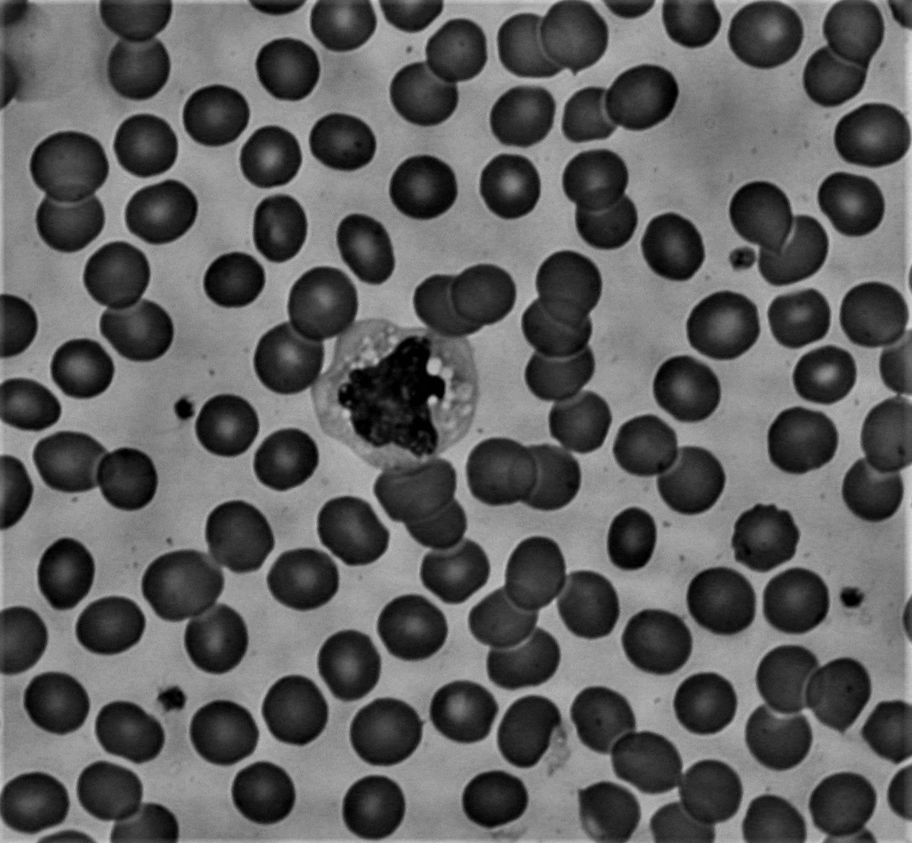
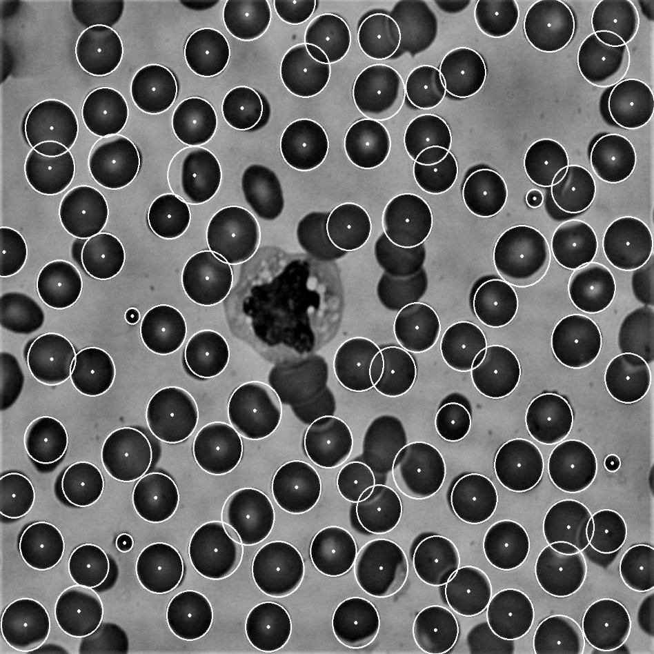

# dot-counter
Count number of dots in a picture. Can be used for cell counting.

# Example output:
| original image | image showing circles
:-------------------------:|:-------------------------:
  |  
